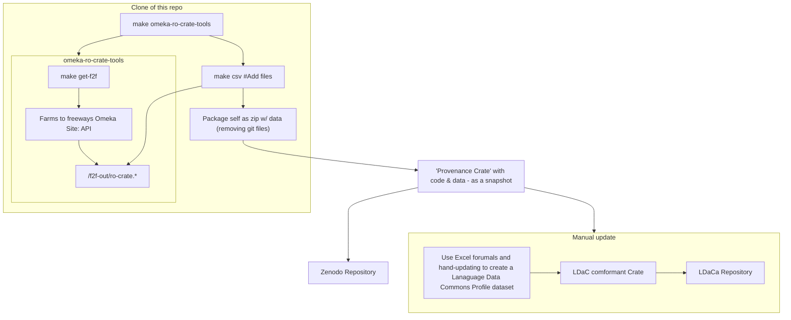

# Farms to Freeways Corpus Tools

This repository documents how to build a language corpus from the Farms to Freeways history project data.


The data is published on its own domain as an Omeka Classic site [available in an Omeka Repository](https://omeka.westernsydney.edu.au/farmstofreeways/) which is considered the published version of the collection.

The data are [archived at Western Sydney University](https://research-data.westernsydney.edu.au/published/31f45ab0519411ecb15399911543e199/). This does not appear to have a persistent ID and the web page is "orphaned" in that it does not have links to the data repository (which appears to be an instance of [ReDBox](https://www.redboxresearchdata.com.au/plan), maintained by QCIF)

The transcripts in the Omeka repository are in PDF format and speaker turns are only indicated using bold-face text.

There are some [plain text versions available](https://research-data.westernsydney.edu.au/default/rdmp/pubrecord/bc45b4d0519311ecb15399911543e199/pubattach/6627738d4a73422786bfc350aac0ff1c?pubId=31f45ab0519411ecb15399911543e199) but they don't have speaker turns indicated.

This repository contains scripts to:
- Download the published version of Farms to Freeways as an RO-Crate
- Derive CSV formatted transcripts from the PDF versions, which have been formatted to indicate which speaker is speaking in each turn (the interviewer is in bold text). These transcripts don't have the IDs of the speakers but can be used to distinguish interviewer from interviewee.


If you got this dataset from Zenodo as a download then the data is already in this dataset 

## Overview




## Install (on macos)

- Get RO-Crate Excel - TODO - Rosanna plz write up
- Install LibreOffice: ```brew install LibreOffice``` 


## Usage

The makedfile in this project handles everything.

```
make omeka-ro-crate-tools #Installs RO-crate tools from github and fetches data from Omeka
```

```
make omeka-ro-crate-tools/svg #Converts PDF transcript files from the repo to svg 
```


```
make omeka-ro-crate-tools/csv #Converts PDF transcript files from the repo to CSV 
```


